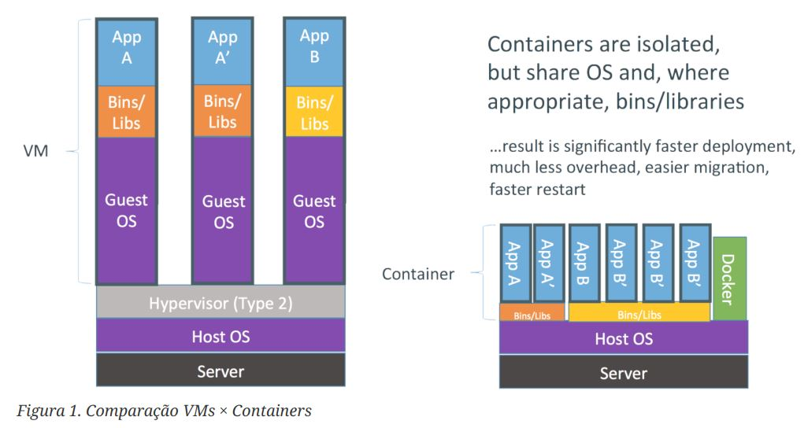
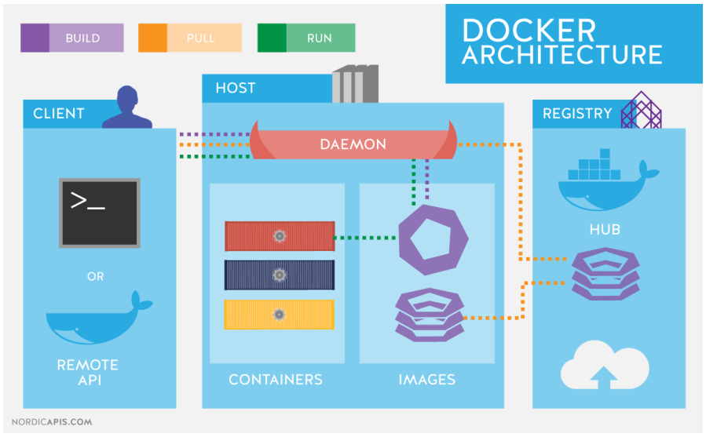
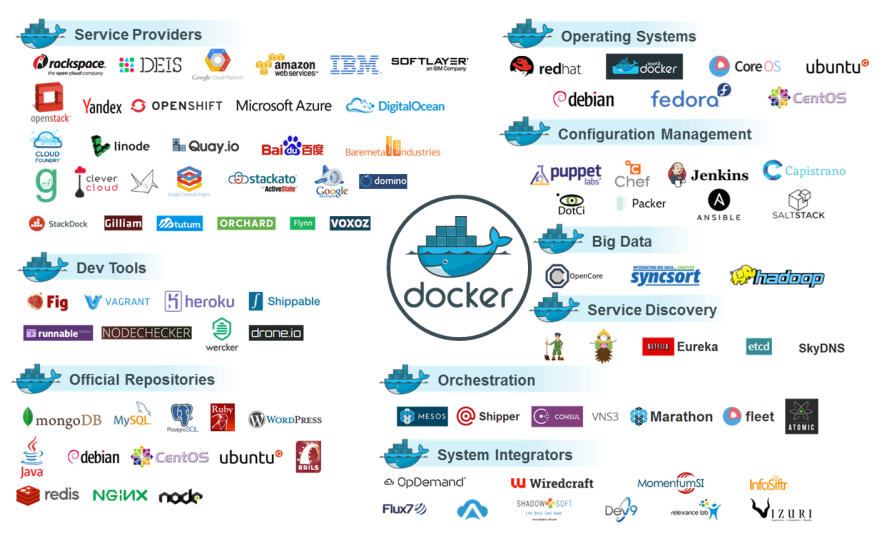
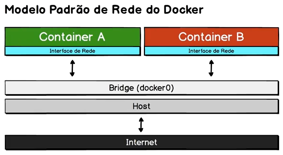
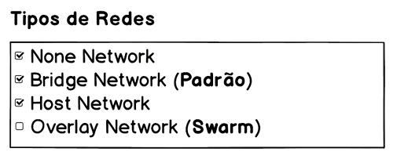
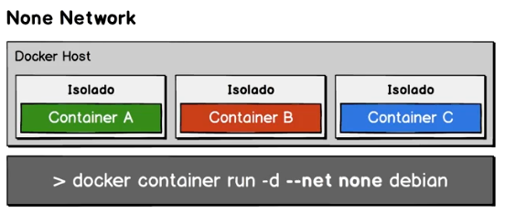
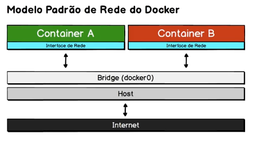

# Docker: Ferramenta essencial para Desenvolvedores (Udemy)

https://www.udemy.com/curso-docker/learn/v4/overview

"No curso você aprenderá os principais conceitos do Docker com vários exercícios práticos, todos descritos detalhadamente na apostila que será disponibilizada no curso. Tudo que for ministrado no curso estará disponível na apostila, e ter esse suporte a mais, será um diferencial fantástico."

## <a name="indice">Índice</a>

1. [Seção: 1 - Introdução (5)](#parte1)     
2. [Seção: 2 - Conceitos (6)](#parte2)     
3. [Seção: 3 - Instalação (4)](#parte3)     
4. [Seção: 4 - Uso Básico do Docker (14)](#parte4)     
5. [Seção: 5 - Deixando de Ser Apenas um Usuário (11)](#parte5)     
6. [Seção: 6 - Redes (4)](#parte6)     
7. [Seção: 7 - Coordenando Múltiplos Containers (2)](#parte7)     
8. [Seção: 8 - Projeto Cadastro Simples (3)](#parte8)     
9. [Seção: 9 - Projeto para Envio de E-mails com Workers (11)](#parte9)     
---

## <a name="parte1">Seção: 1 - Introdução (5)</a>

- [Mateiral do Curso/Instrutor](https://github.com/josemalcher/curso-docker)

- [PDF do curso](http://files.cod3r.com.br/apostila-docker.pdf)[ ou PDF do curso local](https://github.com/ClaudioMendonca-Eng/Udemy-Docker-Ferramenta-essencial-para-Desenvolvedores/blob/main/pdf/Apostila-Docker.pdf)

[Voltar ao Índice](#indice)

---

## <a name="parte2"> Seção: 2 - Conceitos (6)</a>

#### 1.1. O que é Docker?

É uma ferramenta que se apoia em recursos existentes no kernel, inicialmente Linux, para isolar a execução de processos. As ferramentas que o Docker traz são basicamente uma camada de administração de containers, baseado originalmente no LXC.

Alguns isolamentos possíveis:
- Limites de uso de memória
- Limites de uso de CPU
- Limites de uso de I/O
- Limites de uso de rede
- Isolamento da rede (que redes e portas são acessíveis)
- Isolamento do file system
- Permissões e Políticas
- Capacidades do kernel

Podemos concluir dizendo que estes recursos já existiam no kernel a um certo tempo, o que o Docker nos trouxe foi uma maneira simples e efetiva de utiliza-los.
- https://www.docker.com/what-docker

Containers Docker empacotam componentes de software em um sistema de arquivos completo, que contêm tudo necessário para a execução: código, runtime, ferramentas de sistema - qualquer coisa que possa ser instalada em um servidor.

Isto garante que o software sempre irá executar da mesma forma, independente do seu ambiente.

#### 1.2. Por que não uma VM?

O Docker tende a utilizar menos recursos que uma VM tradicional, um dos motivos é não precisar de uma pilha completa como vemos em Comparação VMs × Containers. O Docker utiliza o mesmo
kernel do host, e ainda pode compartilhar bibliotecas.

Mesmo utilizando o mesmo kernel é possível utilizar outra distribuição com versões diferentes das bibliotecas e aplicativos.



Virtual Machine (máquina virtual), recurso extremamente usado atualmente para isolamento de serviços, replicação e melhor aproveitamento do poder de processamente de uma máquina física.

Devo trocar então minha VM por um container? Nem sempre, os containers Docker possuem algumas limitações em relação as VMs:
- Todas as imagens são linux, apesar do host poder ser qualquer SO que use ou emule um kernel linux, as imagens em si serão baseadas em linux.
- Não é possível usar um kernel diferente do host, o Docker Engine estará executando sob uma determinada versão (ou emulação) do kernel linux, e não é possível executar uma versão diferente, pois as imagens não possuem kernel.

#### 1.3. O que são containers?

Container é o nome dado para a segregação de processos no mesmo kernel, de forma que o processo seja isolado o máximo possível de todo o resto do ambiente.

Em termos práticos são File Systems, criados a partir de uma "imagem" e que podem possuir também algumas características próprias.


- https://www.docker.com/what-container

#### 1.4. O que são imagens Docker?

Uma imagem Docker é a materialização de um modelo de um sistema de arquivos, modelo este produzido através de um processo chamado build.

Esta imagem é representada por um ou mais arquivos e pode ser armazenada em um repositório.

**Docker File Systems**

O Docker utiliza file systems especiais para otimizar o uso, transferência e armazenamento das imagens, containers e volumes.

O principal é o AUFS, que armazena os dados em camadas sobrepostas, e somente a camada mais recente é gravável.
- https://pt.wikipedia.org/wiki/Aufs
- https://docs.docker.com/engine/userguide/storagedriver/aufs-driver/

#### 1.5. Arquitetura

De maneira simplificada podemos dizer que o uso mais básico do Docker consiste em:
- Ter o serviço Docker Engine rodando
- Ter acesso a API Rest do Docker Engine, normalmente através do Docker Client
- Baixar uma imagem do Docker Registry, normalmente do registry público oficial: https://hub.docker.com
- Instanciar um container a partir da imagem baixada



Figura 2. Arquitetura do Docker

#### 1.6. Crescimento do Docker

A primeira versão do Docker é de 13 de março de 2013, tendo um pouco mais de 4 anos (na epóca que este curso foi escrito).

Nestes 4 anos ele tem se tornado cada vez mais popular e uma solução real para desenvolvedores (manter o seu ambiente mais simples e próximo à produção), administradores de sistema e ultimamente para uso enterprise, sendo avaliado pelos principais players do mercado uma alternativa mais econômica em relação as soluções atuais. Em sua maioria virtualização.




[Voltar ao Índice](#indice)

---

## <a name="parte3"> Seção: 3 - Instalação (4)</a>

#### 2.1. Docker Engine e Docker Machine

- Instalação (Linux, Microsoft Windows e MacOS)
- Uso do Docker Machine
- Uso do Docker na nuvem, Amazon, possivelmente outros

[Voltar ao Índice](#indice)

---


## <a name="parte4"> Seção: 4 - Uso Básico do Docker (14)</a>

#### 3.1. Introdução ao Docker Client

Conforme vimos em Arquitetura, o Docker Engine expõe uma API Rest que pode ser consumida pelas mais diversas ferramentas. A ferramenta inicial fornecida com a própria engine é o Docker Client, utilitário de linha de comando.

#### 3.2. Hello World: Meu Docker funciona !

Vamos confirmar o funcionamento do nosso Docker.

```
# docker container run hello-world
Hello from Docker!
This message shows that your installation appears to be working correctly.
To generate this message, Docker took the following steps:
 1. The Docker client contacted the Docker daemon.
 2. The Docker daemon pulled the "hello-world" image from the Docker Hub.
    (amd64)
 3. The Docker daemon created a new container from that image which runs the
    executable that produces the output you are currently reading.
 4. The Docker daemon streamed that output to the Docker client, which sent it
    to your terminal.
To try something more ambitious, you can run an Ubuntu container with:
 $ docker run -it ubuntu bash
Share images, automate workflows, and more with a free Docker ID:
 https://hub.docker.com/
For more examples and ideas, visit:
 https://docs.docker.com/get-started/
```

Na documentação oficial, o passo para verificação da instalação é este Hello World, porém até a publicação deste curso a documentação ainda utilizava a sintaxe antiga: docker run hello-world
- https://docs.docker.com/engine/getstarted/step_one/#step-3-verify-your-installation

Testar correto funcionamento do Docker, incluindo a recuperação de imagens e execução de containers.

#### 3.3. Meu querido amigo run

O comando run é a nossa porta de entrada no Docker, agrupando diversas funcionalidades básicas, como:
- Download automático das imagens não encontradas: docker image pull
- Criação do container: docker container create
- Execução do container: docker container start
- Uso do modo interativo: docker container exec

A partir da versão 1.13, o Docker reestruturou toda a interface da linha de comando, para agrupar melhor os comandos por contexto.

Apesar dos comandos antigos continuarem válidos, o conselho geral é adotar a nova sintaxe.
- https://blog.docker.com/2017/01/whats-new-in-docker-1-13/#h.yuluxi90h1om

Até a versão 17.03 (corrente na publicação do curso), ainda é possível utilizarmos a sintaxe antiga, porém precisamos pensar nela como atalhos:

```
docker pull
    docker image pull
docker create
    docker container create
docker start
    docker container start
docker exec
    docker container exec
```


#### 3.4. Modo interativo

Podemos usar containers em modo interativo, isto é extremamente útil para processos experimentais, estudo dinâmico de ferramentas e de desenvolvimento.

Exemplos de Uso
- Avaliação do comportamento ou sintaxe de uma versão específica de linguagem.
- Execução temporária de uma distribuição linux diferente
- Execução manual de um script numa versão diferente de um interpretador que não a instalada no host.

Principais opções do Docker para este fim
- docker container run -it
- docker container start -ai
- docker container exec -t

Exercício 2 - Ferramentas diferentes

```
# bash --version
GNU bash, version 4.4.19(1)-release (x86_64-alpine-linux-musl)
Copyright (C) 2016 Free Software Foundation, Inc.
License GPLv3+: GNU GPL version 3 or later <http://gnu.org/licenses/gpl.html>

This is free software; you are free to change and redistribute it.
There is NO WARRANTY, to the extent permitted by law.
# docker container run debian bash --version
Unable to find image 'debian:latest' locally
latest: Pulling from library/debian
f606d8928ed3: Pull complete
Digest: sha256:e538a2f0566efc44db21503277c7312a142f4d0dedc5d2886932b92626104bff
Status: Downloaded newer image for debian:latest
GNU bash, version 5.1.4(1)-release (x86_64-pc-linux-gnu)
Copyright (C) 2020 Free Software Foundation, Inc.
License GPLv3+: GNU GPL version 3 or later <http://gnu.org/licenses/gpl.html>

This is free software; you are free to change and redistribute it.
There is NO WARRANTY, to the extent permitted by law.
```

Confirmar que o conjunto de ferramentas disponíveis em um container são diferentes das disponíveis no host.

**Exercício 3 - run cria sempre novos containers**

```
# docker container run -it debian bash
root@53a6df47194e:/# touch /curso-docker.txt
root@53a6df47194e:/# exit
exit
# docker container run -it debian bash
root@85d396adffcf:/# ls
bin  boot  dev  etc  home  lib  lib64  media  mnt  opt  proc  root  run  sbin  srv  sys  tmp  usr  var
root@85d396adffcf:/# ls /curso-docker.txt
ls: cannot access '/curso-docker.txt': No such file or directory
```

Demonstrar que o run sempre irá instanciar um novo container.
Como vimos em Docker File Systems, o container e a imagem são armazenados em camadas, o processo de instanciar um container basicamente cria uma nova camada sobre a imagem existente, para que nessa camada as alterações sejam aplicadas.

Assim sendo o consumo de espaço em disco para instanciar novos containers é relativamente muito baixo.

**Exercício 4 - Containers devem ter nomes únicos**

```
# docker container run --name mydeb -it debian bash
root@b6b62dbe8453:/# exit
exit
# docker container run --name mydeb -it debian bash
docker: Error response from daemon: Conflict. The container name "/mydeb" is already in use by container "b6b62dbe84539c2dd13a5feddf9bd29682b0d5913cf18694396428fc3f8bbbb3". You have to remove (or rename) that container to be able to reuse that name.
See 'docker run --help'.
```

**Exercício 5 - Reutilizar containers**

```
# docker container start -ai mydeb
root@b6b62dbe8453:/# ls
bin  boot  dev  etc  home  lib  lib64  media  mnt  opt  proc  root  run  sbin  srv  sys  tmp  usr  var
root@b6b62dbe8453:/# touch /curso-docker.txt
root@b6b62dbe8453:/# ls
bin   curso-docker.txt  etc   lib    media  opt   root  sbin  sys  usr
boot  dev               home  lib64  mnt    proc  run   srv   tmp  var
root@b6b62dbe8453:/# exit
exit
# docker container start -ai mydeb
root@b6b62dbe8453:/# ls /curso-docker.txt
/curso-docker.txt
root@b6b62dbe8453:/# exit
exit
```

Demonstrar o uso do start em modo interativo, reutilizando um container previamente criado, além de confirmar que o mesmo consegue reter modificações em seu file system.

**Remover depois que executar (não salav na lista de containers) -> --rm**

```
# docker container ps -a
CONTAINER ID   IMAGE               COMMAND                  CREATED         STATUS                       PORTS     NAMES
b6b62dbe8453   debian              "bash"                   3 minutes ago   Exited (0) 51 seconds ago              mydeb
85d396adffcf   debian              "bash"                   6 minutes ago   Exited (127) 3 minutes ago             nice_gates
53a6df47194e   debian              "bash"                   7 minutes ago   Exited (0) 6 minutes ago               vigorous_varahamihira
831a32f8c858   debian              "bash --version"         8 minutes ago   Exited (0) 8 minutes ago               fervent_wright
# docker container run --rm debian bash --version
GNU bash, version 5.1.4(1)-release (x86_64-pc-linux-gnu)
Copyright (C) 2020 Free Software Foundation, Inc.
License GPLv3+: GNU GPL version 3 or later <http://gnu.org/licenses/gpl.html>
This is free software; you are free to change and redistribute it.
There is NO WARRANTY, to the extent permitted by law.
#  docker container ps -a
CONTAINER ID   IMAGE               COMMAND                  CREATED         STATUS                       PORTS     NAMES
b6b62dbe8453   debian              "bash"                   5 minutes ago   Exited (0) 2 minutes ago               mydeb
85d396adffcf   debian              "bash"                   8 minutes ago   Exited (127) 5 minutes ago             nice_gates
53a6df47194e   debian              "bash"                   8 minutes ago   Exited (0) 8 minutes ago               vigorous_varahamihira
831a32f8c858   debian              "bash --version"         9 minutes ago   Exited (0) 9 minutes ago               fervent_wright
```

#### 3.5. Cego, surdo e mudo, só que não !

Um container normalmente roda com o máximo de isolamento possível do host, este isolamento é possível através do Docker Engine e diversas características provídas pelo kernel.

Mas normalmente não queremos um isolamento total, e sim um isolamento controlado, em que os recursos que o container terá acesso são explicitamente indicados. Principais recursos de controle do isolamento
- Mapeamento de portas
- Mapeamento de volumes
- Copia de arquivos para o container ou a partir do container
- Comunicação entre os containers

#### 3.5.1. Mapeamento de portas

É possível mapear tanto portas TCP como UDP diretamente para o host, permitindo acesso através de toda a rede, não necessitando ser a mesma porta do container. O método mais comum para este fim é o parâmetro -p no comando docker container run, o -p recebe um parâmetro que normalmente é composto por dois números separados por : (dois pontos). O primeiro é no host e o segundo é no container

```
# docker container run -p 8080:80 nginx
172.17.0.1 - - [18/Octo/2022:19:31:00 +0000] "GET / HTTP/1.1" 200 612 "-" "Mozilla/5.0 (X11; Fedora; Linux x86_64) AppleWebKit/537.36 (KHTML, like Gecko) 
2022/10/18 19:31:01 [error] 9#9: *1 open() "/usr/share/nginx/html/favicon.ico" failed (2: No such file or directory), client: 172.17.0.1, server: localhost, request: "GET /favicon.ico HTTP/1.1", host: "localhost:8080", referrer: "http://localhost:8080/"
172.17.0.1 - - [18/Octo/2022:19:31:01 +0000] "GET /favicon.ico HTTP/1.1" 404 556 "http://localhost:8080/" "Mozilla/5.0 (X11; Fedora; Linux x86_64) AppleWebKit/537.36 (KHTML, like Gecko) ...
```

Mapeamento de portas
- Acessar a url http://localhost:8080 por um browser
- Receber a mensagem: Welcome to nginx no browser
- Verificar o log de acesso no terminal executando
- Tentar acessar a url http://localhost ou http://localhost:80
- Receber um erro do browser
- Parar a execução do container

#### 3.5.2. Mapeamento de volumes

É possível mapear tanto diretórios no host como entidades especiais conhecidas como volumes para diretórios no container. Por enquanto vamos nos concentrar no mapeamento mais simples, uma diretório no host para um diretório no container. O método mais comum para este fim é o parâmetro -v no comando docker container run, o -v recebe um parâmetro que normalmente é composto por dois caminhos absolutos separados por : (dois pontos). Assim como diversos outros parâmetros, o primeiro é no host e o segundo é no container.

O trecho do comando chamado "pwd". Esse comando retorna o caminho atual da pasta onde o terminal está localizado. Porém, esse "pwd" não irá funcionar em todos os terminais ou sistemas operacionais.
Caso não funcione será necessário utilizar o comando absoluto da pasta em questão. Ou seja, algo como "c/users/SeuNome/docker", variando com a localização da pasta em questão.

**Exercício 7 - Mapear diretórios para o container**

```
# docker container run -p 8080:80 -v $(pwd)/html:/usr/share/nginx/html nginx
2022/10/18 20:34:49 [error] 9#9: *2 "/usr/share/nginx/html/index.html" is forbidden (13: Permission denied), client: 172.17.0.1, server: localhost, request: "GET / HTTP/1.1", host: "localhost:8080"
172.17.0.1 - - [18/Octo/2022:20:34:49 +0000] "GET / HTTP/1.1" 403 556 "-" "Mozilla/5.0 (X11; Fedora; Linux x86_64) AppleWebKit/537.36 (KHTML, like Gecko) 
# docker container run -p 8080:80 -v $(pwd)/html:/usr/share/nginx/html:Z nginx
172.17.0.1 - - [18/Octo/2022:20:36:37 +0000] "GET / HTTP/1.1" 200 287 "-" "Mozilla/5.0 (X11; Fedora; Linux x86_64) AppleWebKit/537.36 (KHTML, like Gecko) 
```

*(:Z dá permissão de escrita a pasta) 👈

Mapeamento de volumes
- Executar o run.sh
- Acessar a url http://localhost:8080 por um browser
- Receber o erro: 403 Forbidden
- Verificar o log de acesso no terminal executando
- Parar a execução do container
- Executar o run-alt.sh (que mapea o diretório com o index.html)
- Tentar acessar a url http://localhost:8080
- Receber o texto: Hello World
- Bônus: Editar o html/index.html a partir de um editor de textos e atualizar o browser
- Parar a execução do container

#### 3.6. Modo daemon
Agora sim, aonde o Docker começa a brilhar!

Antes de conhecer opções mais avançadas de compartilhamento de recursos, isolamento, etc, precisamos entender como rodar os containers em background. O parâmetro -d do docker container run indica ao Docker para iniciar o container em background (modo daemon).

Para entender melhor estes containers precisaremos conhecer um novo comando: docker container ps, que lista containers em execução.

**Exercício 8 - Rodar um servidor web em background**

```
# docker container run -d --name ex-daemon-basic -p 8080:80 -v $(pwd)/html:/usr/share/nginx/html:Z nginx
ex-daemon-basic,nginx
Up 28 seconds, PORTA: 0.0.0.0:8080->80/tcp
# docker container stop ex-daemon-basic 
ex-daemon-basic
```

Execução em background
- Levanta o container em background
- Tentar acessar a url http://localhost:8080 via browser
- Receber o texto: Hello World
- Verificar os containers em execução

**Exercício 9 - Gerenciar o container em background**

```
# docker container restart ex-daemon-basic
# docker container stop ex-daemon-basic
# docker container start ex-daemon-basic
```

Reiniciar, parar e iniciar
- Reinicia o container e verifica que acabou de iniciar pelo tempo do status
- Para o container e através do docker container ps vemos que não está mais em execução
- Podemos também tentar acessar pelo browser a url http://localhost:8080, confirmando que não responde mais
- Inicia novamente o container, um observação importante é que não é mais necessário configurar os mapeamentos
- Verificar os containers em execução, também é possível confirmar a execução pelo browser.

#### 3.7. Manipulação de containers em modo daemon

Existem diversos comandos que nos ajuda a acompanhar a execução dos containers, entre eles:
- docker container ls
- docker container ls -a
- docker container inspect
- docker container exec
- docker container logs

Vários comandos Docker possuem aliases, por exemplo o container ls tem os seguintes apelidos:
- docker container list
- docker container ps
- docker ps (antiga sintaxe)


#### 3.8. Nova sintaxe do Docker Client

Agora que já vimos diversos comandos, incluindo tanto a sintaxe nova quanto a velha, podemos entender os principais motivos para esta mudança e a preferência pela nova sintaxe:
- Melhor utilização de comandos similares em contextos diferentes:
  - docker container ls
  - docker image ls
  - docker volume ls
- Maior clareza nos comandos:
  - docker container rm ao invés de docker rm
  - docker image rm ao inveś de docker rmi
  - docker image ls ao invés de docker images
- Mais simplicidade para criação de novos subcomandos
 - Segregação da documentação e helps por contexto


[Voltar ao Índice](#indice)

---


## <a name="parte5"> Seção: 5 - Deixando de Ser Apenas um Usuário (11)</a>

#### 4.1. Introdução

Agora vamos ao conceitos necessários para deixar de apenas utilizar imagens prontas e começar a produzir nossas próprias imagens.

Exemplos de uso
- DevOps - Imagens para processos de integração contínua
- Portabilidade - Imagens de aplicação para ser utilizada em todos os ambientes (staging, prodution, etc)
- Desenvolvimento - Imagens que aproximam todos os devs do ambiente de produção e diminuem a curva de entrada de novos membros
- Imagens customizadas a partir de imagens públicas

#### 4.2. Diferenças entre container e imagem

Utilizando uma analogia com OOP, podemos comparar um container a um objeto (instância), enquanto a imagem seria uma classe (modelo).

Todos os subcomandos relativos ao container podem ser listados através do parâmetro --help, bem como imagens:
- docker container --help
- docker image --help

#### 4.3. Entendendo melhor as imagens

Toda imagem (bem como os containers) possuem um identificador único em formato hash usando sha256. Porém seu uso não é muito prático, então para simplificar isto o docker utiliza uma tag para identificar imagens.

A tag normalmente é formada por um nome, seguido de : dois pontos e depois uma versão. É extremamente comum utilizar uma versão chamada latest para representar a versão mais atual.

Exemplos de tags de imagens:
- nginx:latest
- redis:3.2
- redis:3
- postgres:9.5

Na prática uma tag é apenas um ponteiro para o hash da imagem, e várias tags podem apontar para o mesmo hash. Com isto é comum o uso de alguns apelidos nas tags, tomando como exemplo as imagens oficiais do redis. Existem 10 imagens e 30 tags.

Tags do redis

- 3.0.7, 3.0
- 3.0.7-32bit, 3.0-32bit
- 3.0.7-alpine, 3.0-alpine
- 3.0.504-windowsservercore, 3.0-windowsservercore
- 3.0.504-nanoserver, 3.0-nanoserver
- 3.2.8, 3.2, 3, latest
- 3.2.8-32bit, 3.2-32bit, 3-32bit, 32bit
- 3.2.8-alpine, 3.2-alpine, 3-alpine, alpine
- 3.2.100-windowsservercore, 3.2-windowsservercore
- 3-windowsservercore, windowsservercore
- 3.2.100-nanoserver, 3.2-nanoserver, 3-nanoserver, nanoserver

fonte: https://hub.docker.com/_/redis/

```
# docker image pull redis:latest
latest: Pulling from library/redis
bd159e379b3b: Already exists
729b630784ac: Pull complete
065c77bf222a: Pull complete
961784053f68: Pull complete
b42f16846808: Pull complete
0f1fa5bb0033: Pull complete
Digest: sha256:c95835a74c37b3a784fb55f7b2c211bd20c650d5e55dae422c3caa9c01eb39fa
Status: Downloaded newer image for redis:latest
# docker image ls
REPOSITORY                           TAG                 IMAGE ID            CREATED             SIZE
redis                               latest               f8528f17261c        2 weeks ago        117MB
# docker image tag redis:latest redis-claudiomendonca
# docker image ls
REPOSITORY                           TAG                 IMAGE ID            CREATED             SIZE
redis                                latest              f8528f17261c        2 weeks ago        117MB
redis-claudiomendonca                latest              f8528f17261c        2 weeks ago        117MB
# docker image rm redis:latest redis-claudiomendonca
Untagged: redis:latest
Untagged: redis@sha256:c95835a74c37b3a784fb55f7b2c211bd20c650d5e55dae422c3caa9c01eb39fa
Untagged: redis-claudiomendonca:latest
Deleted: sha256:f8528f17261c4a2c94ef702ff483ba7e4b998aa734cba60fa689ca5ecc14705f
Deleted: sha256:ee56963c6d7b3a0282a5fa661ff94f9d85cee3c52058246ed243af49e724a55a
Deleted: sha256:716572502758d2842fc9a1f4211a54c649babfdaea435e3f30b9b5aaf87cb06d
Deleted: sha256:e44a83ab8337d6a95fcad0c1d250366c4079759ae5be8f6ce321dc4ea613217f
Deleted: sha256:4267b0eb985fc1c59e8f523eb77202c30a6504d86186b1377d22e736061b321c
Deleted: sha256:fc24995fdc7260d59418714deda07229a703bca3d64f6f19c7ade1e3c0fb2d55
```

#### 4.4. Comandos básicos no gerenciamento de imagens

Já usamos de maneira implícita o recurso de download de imagens docker, agora vamos entender melhor o gerenciamento de imagens.

**docker image pull <tag>**  
Baixa a imagem solicitada, este comando pode ser executado implicitamente, quando o docker precisa de uma imagem para outra operação e não consegue localiza-la no cache local.

**docker image ls**  
Lista todas as imagens já baixadas, é possível ainda usar a sintaxe antiga: docker images

**docker image rm <tag>**  
Remove uma imagem do cache local, é possível ainda usar a sintaxe antiga: docker rmi <tag>

**docker image inspect <tag>**  
Extrai diversas informações utilizando um formato JSON da imagem indicada.

**docker image tag <source> <tag>**  
Cria uma nova tag baseada em uma tag anterior ou hash.

**docker image build -t <tag>**  
Permite a criação de uma nova imagem, como veremos melhor em build.

**docker image push <tag>**  
Permite o envio de uma imagem ou tag local para um registry.

#### 4.5. Docker Hub × Docker Registry

**Docker Registry**  
É uma aplicação server side para guardar e distribuir imagens Docker. 

**Docker Hub**  
É uma serviço de registro de imagens Docker em nuvem, que permite a associação com repositórios para build automatizado de imagens. Imagens marcadas como oficiais no Docker Hub, são criadas pela própria Docker Inc. E o código fonte pode ser encontrado em:
- https://github.com/docker-library

A linha de comando possui o comando docker search <tag> para procurar imagens no Docker Hub.

#### 4.6. Construção de uma imagem

Processo para gerar uma nova imagem a partir de um arquivo de instruções. O comando docker build é o responsável por ler um Dockerfile e produzir uma nova imagem Docker.

**Dockerfile**  
Nome default para o arquivo com instruções para o build de imagens Docker. Documentação do Dockerfile — https://docs.docker.com/engine/reference/builder

```
# docker image build -t ex-simple-build .
[+] Building 1.0s (6/6) FINISHED
 => [internal] load build definition from Dockerfile                                  0.1s
 => => transferring dockerfile: 122B                                                  0.0s
 => [internal] load .dockerignore                                                     0.0s
 => => transferring context: 2B                                                       0.0s
 => [internal] load metadata for docker.io/library/nginx:1.13                         0.0s
 => [1/2] FROM docker.io/library/nginx:1.13                                           0.2s
 => [2/2] RUN echo '<h1>Hello World !</h1>' > /usr/share/nginx/html/index.html        0.5s
 => exporting to image                                                                0.1s
 => => exporting layers                                                               0.1s
 => => writing image sha256:250bdd713c909deb323989c4572297d5f8a73eb5e8ba117d9752d86c  0.0s
 => => naming to docker.io/library/ex-simple-build                                    0.0s5
Status: Downloaded newer image for docker.io/nginx:1.13
 ---> ae513a47849c
Step 2/2 : RUN echo '<h1>Hello World !</h1>' > /usr/share/nginx/html/index.html
 ---> Running in 65d04840a156
 ---> 74f08697b0a1
Removing intermediate container 65d04840a156
# docker image ls
REPOSITORY                           TAG                 IMAGE ID            CREATED             SIZE
ex-simple-build                     latest               250bdd713c90        2 minutes ago      109MB
# docker container run -p 8080:80 ex-simple-build
172.17.0.1 - - [19/Oct/2022:21:54:11 +0000] "GET / HTTP/1.1" 200 23 "-" "Mozilla/5.0 (Windows NT 10.0; Win64; x64) AppleWebKit/537.36 (KHTML, like Gecko) Chrome/106.0.0.0 Safari/537.36" "-"
```

Exemplo básico de um build e sua execução.

O comando build exige a informação do diretório aonde o build será executado bem como aonde o arquivo de instruções se encontra


#### 4.7. Instruções para a preparação da imagem

**FROM**  
Especifica a imagem base a ser utilizada pela nova imagem.

**LABEL**  
Especifica vários metadados para a imagem como o mantenedor. A especificação do mantenedor era feita usando a instrução específica, MAINTAINER que foi substituída pelo LABEL.

**ENV**  
Especifica variáveis de ambiente a serem utilizadas durante o build.

**ARG**  
Define argumentos que poderão ser informados ao build através do parâmetro --build-arg.

```
FROM debian
LABEL maintainer 'Claudio Mendonça. <contato@claudiomendonca.eng.br>'
ARG S3_BUCKET=files
ENV S3_BUCKET=${S3_BUCKET}
```

```
# docker image build -t ex-build-args .
[+] Building 0.2s (5/5) FINISHED
 => [internal] load build definition from Dockerfile                                  0.0s
 => => transferring dockerfile: 175B                                                  0.0s
 => [internal] load .dockerignore                                                     0.0s
 => => transferring context: 2B                                                       0.0s
 => [internal] load metadata for docker.io/library/debian:latest                      0.0s
 => [1/1] FROM docker.io/library/debian                                               0.0s
 => exporting to image                                                                0.0s
 => => exporting layers                                                               0.0s
 => => writing image sha256:3ee35ed74a5dd27593c2c8c2b1485ecf040220e8a523a9a48d31e0ed  0.0s
 => => naming to docker.io/library/ex-build-args                                      0.0s
# docker image ls
REPOSITORY                           TAG                 IMAGE ID            CREATED             SIZE
ex-build-args                        latest              3ee35ed74a5d        2 weeks ago          124MB
ex-simple-build                       latest             250bdd713c90        10 minutes ago       109MB 
# docker container run ex-build-args bash -c 'echo $S3_BUCKET'
files
# docker image build --build-arg S3_BUCKET=myapp -t ex-build-arg .
[+] Building 0.2s (5/5) FINISHED
 => [internal] load build definition from Dockerfile                                  0.0s
 => => transferring dockerfile: 32B                                                   0.0s
 => [internal] load .dockerignore                                                     0.0s
 => => transferring context: 2B                                                       0.0s
 => [internal] load metadata for docker.io/library/debian:latest                      0.0s
 => CACHED [1/1] FROM docker.io/library/debian                                        0.0s
 => exporting to image                                                                0.0s
 => => exporting layers                                                               0.0s
 => => writing image sha256:0bdabbed8392aa154cdc930419c71af591984bec76d768a348ad066c  0.0s
 => => naming to docker.io/library/ex-build-arg                                       0.0s
# docker container run ex-build-arg bash -c 'echo $S3_BUCKET'
myapp
# docker image inspect --format="{{index .Config.Labels \"maintainer\"}}" ex-build-args
Claudio Mendonça. <contato@claudiomendonca.eng.br>
```

#### 4.8. Instruções para povoamento da imagem

**COPY**  
Copia arquivos e diretórios para dentro da imagem.

**ADD**  
Similar ao anterior, mas com suporte extendido a URLs. Somente deve ser usado nos casos que a instrução COPY não atenda.

**RUN**  
Executa ações/comandos durante o build dentro da imagem

**Exercício 12 - Uso das instruções de povoamento**

```
FROM nginx:1.13
LABEL maintainer 'Juracy Filho <juracy at gmail.com>'
RUN echo '<h1>Sem conteúdo</h1>' > /usr/share/nginx/html/conteudo.html
COPY *.html /usr/share/nginx/html/
```

```
# docker image build -t ex-build-copy .
[+] Building 0.9s (8/8) FINISHED
 => [internal] load build definition from Dockerfile                                  0.1s
 => => transferring dockerfile: 230B                                                  0.0s
 => [internal] load .dockerignore                                                     0.0s
 => => transferring context: 2B                                                       0.0s
 => [internal] load metadata for docker.io/library/nginx:1.13                         0.0s
 => CACHED [1/3] FROM docker.io/library/nginx:1.13                                    0.0s
 => [internal] load build context                                                     0.1s
 => => transferring context: 413B                                                     0.0s
 => [2/3] RUN echo '<h1>Sem conteúdo</h1>' > /usr/share/nginx/html/conteudo.html      0.5s
 => [3/3] COPY *.html /usr/share/nginx/html/                                          0.1s
 => exporting to image                                                                0.1s
 => => exporting layers                                                               0.1s
 => => writing image sha256:9fe5a71b4b7809f91838ac6912eed50b845c2aa33ce2d48bc28b054b  0.0s
 => => naming to docker.io/library/ex-build-copy                                      0.0s
# docker container run -p 8080:80 ex-build-copy
172.17.0.1 - - [19/Oct/2022:22:21:03 +0000] "GET / HTTP/1.1" 200 374 "-" "Mozilla/5.0 (Windows NT 10.0; Win64; x64) AppleWebKit/537.36 (KHTML, like Gecko) Chrome/106.0.0.0 Safari/537.36" "-"
```

#### 4.9. Instruções com configuração para execução do container

**EXPOSE**  
Informa ao Docker que a imagem expõe determinadas portas remapeadas no container. A exposição da porta não é obrigatória a partir do uso do recurso de redes internas do Docker. Recurso que veremos em Coordenando múltiplos containers. Porém a exposição não só ajuda a documentar como permite o mapeamento rápido através do parâmetro -P do docker container run.

**WORKDIR**  
Indica o diretório em que o processo principal será executado.

**ENTRYPOINT**  
Especifica o processo inicial do container.

**CMD**  
Indica parâmetros para o ENTRYPOINT.

**USER**  
Especifica qual o usuário que será usado para execução do processo no container (ENTRYPOINT e CMD) e instruções RUN durante o build.

**VOLUME**  
Instrui a execução do container a criar um volume para um diretório indicado e copia todo o conteúdo do diretório na imagem para o volume criado. Isto simplificará no futuro, processos de compartilhamento destes dados para backup por exemplo.

**Exercício 13 - Uso das instruções para execução do container**

```
FROM python:3.6
LABEL maintainer 'José Malcher JR. <contato@josemalcher.net>'
RUN useradd www && \
    mkdir /app && \
    mkdir /log && \
    chown www /log
USER www
VOLUME /log
WORKDIR /app
EXPOSE 8000
ENTRYPOINT ["/usr/local/bin/python"]
CMD ["run.py"]
```


```
# docker image build -t ex-build-dev .
[+] Building 75.1s (8/8) FINISHED
 => [internal] load build definition from Dockerfile                                                      0.0s
 => => transferring dockerfile: 320B                                                                      0.0s
 => [internal] load .dockerignore                                                                         0.0s
 => => transferring context: 2B                                                                           0.0s
 => [internal] load metadata for docker.io/library/python:3.6                                             2.6s
 => [auth] library/python:pull token for registry-1.docker.io                                             0.0s
 => [1/3] FROM docker.io/library/python:3.6@sha256:f8652afaf88c25f0d22354d547d892591067aa4026a7fa9a6819  66.4s
 => => resolve docker.io/library/python:3.6@sha256:f8652afaf88c25f0d22354d547d892591067aa4026a7fa9a6819d  0.0s
 => => sha256:f8652afaf88c25f0d22354d547d892591067aa4026a7fa9a6819df9f300af6fc 1.86kB / 1.86kB            0.0s
 => => sha256:d097a4907a8ec079df5ac31872359c2de510f82214c0448e926393b376d3b60d 2.22kB / 2.22kB            0.0s
 => => sha256:0e29546d541cdbd309281d21a73a9d1db78665c1b95b74f32b009e0b77a6e1e3 54.92MB / 54.92MB         22.8s
 => => sha256:54260638d07c5e3ad24c6e21fc889abbc8486a27634c0892086ff71f3f44b104 9.27kB / 9.27kB            0.0s
 => => sha256:9b829c73b52b92b97d5c07a54fb0f3e921995a296c714b53a32ae67d19231fcd 5.15MB / 5.15MB            3.2s
 => => sha256:cb5b7ae361722f070eca53f35823ed21baa85d61d5d95cd5a95ab53d740cdd56 10.87MB / 10.87MB          3.8s
 => => sha256:6494e4811622b31c027ccac322ca463937fd805f569a93e6f15c01aade718793 54.57MB / 54.57MB         21.8s
 => => sha256:6f9f74896dfa93fe0172f594faba85e0b4e8a0481a0fefd9112efc7e4d3c78f7 196.51MB / 196.51MB       41.2s
 => => sha256:5e3b1213efc56598e78bd602983945c164de2a37205e06a62dada823124dc743 6.29MB / 6.29MB           26.2s
 => => sha256:9fddfdc56334f2e6efad7e241bf5e7459c40ed105c5478676f41c1244bd96752 14.21MB / 14.21MB         26.8s
 => => extracting sha256:0e29546d541cdbd309281d21a73a9d1db78665c1b95b74f32b009e0b77a6e1e3                16.6s
 => => sha256:404f02044bac0432ca522cbb9f254b1c91fcea6806bfeef0be0b243b2f31bab7 235B / 235B               26.8s
 => => sha256:c4f42be2be53b900ebffc040c1df13de538434ccc5f5d954a56848a6169a3a3f 2.21MB / 2.21MB           28.5s
 => => extracting sha256:9b829c73b52b92b97d5c07a54fb0f3e921995a296c714b53a32ae67d19231fcd                 0.6s
 => => extracting sha256:cb5b7ae361722f070eca53f35823ed21baa85d61d5d95cd5a95ab53d740cdd56                 0.5s
 => => extracting sha256:6494e4811622b31c027ccac322ca463937fd805f569a93e6f15c01aade718793                 5.1s
 => => extracting sha256:6f9f74896dfa93fe0172f594faba85e0b4e8a0481a0fefd9112efc7e4d3c78f7                14.8s
 => => extracting sha256:5e3b1213efc56598e78bd602983945c164de2a37205e06a62dada823124dc743                 0.5s
 => => extracting sha256:9fddfdc56334f2e6efad7e241bf5e7459c40ed105c5478676f41c1244bd96752                 1.1s
 => => extracting sha256:404f02044bac0432ca522cbb9f254b1c91fcea6806bfeef0be0b243b2f31bab7                 0.0s
 => => extracting sha256:c4f42be2be53b900ebffc040c1df13de538434ccc5f5d954a56848a6169a3a3f                 0.5s
 => [2/3] RUN useradd www &&     mkdir /app &&     mkdir /log &&     chown www /log                       5.6s
 => [3/3] WORKDIR /app                                                                                    0.1s
 => exporting to image                                                                                    0.2s
 => => exporting layers                                                                                   0.1s
 => => writing image sha256:345ac8f24cbbcc996f9deebc607481a0a768a040d4cd2e8169e4abda7ad6b6fd              0.0s
 => => naming to docker.io/library/ex-build-dev                                                           0.0s
 
# docker container run -it -v $(pwd):/app:Z -p 8080:8000 --name python-server ex-build-dev
inicializando...
escutando a porta: 8000
usuário: www
172.17.0.1 - - [19/Oct/2022 22:31:20] "GET / HTTP/1.1" 200 -
# docker container run -it --volumes-from=python-server debian cat /log/http-server.log
2022-10-19 22:30:26,763 - INFO - inicializando...
2022-10-19 22:30:26,764 - INFO - escutando a porta: 8000
2022-10-19 22:30:26,765 - INFO - usuário: www
2022-10-19 22:31:20,686 - INFO - 172.17.0.1 - - [19/Oct/2022 22:31:20] "GET / HTTP/1.1" 200 -
2022-10-19 22:31:20,703 - INFO - 172.17.0.1 - - [19/Oct/2022 22:31:20] "GET / HTTP/1.1" 200 -
```

Neste exemplo temos um pequeno servidor web atendendo na porta 8000 e exposta via instrução EXPOSE.

Também temos o uso do ENTRYPOINT e CMD definindo exatamente que processo será executado ao subir o container, podemos notar que o container consegue encontrar o run.py, por conta da instrução WORKDIR que define o diretório aonde o processo principal será executado.

Ao executar o container, uma das informações colocados no log (stdout e arquivo em disco) é o usuário corrente, e podemos notar que o processo não está rodando como root e sim www, conforme foi definido pela instrução USER.

Por último temos o comando VOLUME que instrui o docker a expor o diretório /log como um volume, que pode ser facilmente mapeado por outro container. Podemos verificar isto seguindo os seguintes passos:
- Construir a imagem e executar o container: run.sh
- Acessar a URL http://localhost:8000 via browser
- Verificar o log gerado na saída do container criado
- Criar e rodar um segundo container mapeando os volumes do primeiro e checar o arquivo de log: docker run -it --volumes-from=<container criado> debian cat /log/http-server.log
- Importante substituir a referência do volumes_from pelo hash do primeiro container criado
- O resultado do cat será o mesmo log já gerado pelo primeiro container

#### 11. Enviar Imagens para o Docker Hub (video)

- https://hub.docker.com/

```
# docker image tag img-exemplo claudio/img-exemplo:1.0
// Login
# docker login --username=claudio
Password:
# docker image push claudio/img-exemplo:1.0
```


[Voltar ao Índice](#indice)

---


## <a name="parte6"> Seção: 6 - Redes (4)</a>

#### 6.1. Visão Geral e Tipos de Redes (somente vídeo)




```
 # docker network ls
NETWORK ID          NAME                        DRIVER              SCOPE
01d182c53758        bridge                      bridge              local
b709d632246d        host                        host                local
f835sw4c2415        node-mogo-compose_default   bridge              local
c8a9baq37245        none                        null                local
```

#### 6.2. Rede Tipo None  (Sem Rede)



```
# docker container run --rm alpine ash -c "ifconfig"
Unable to find image 'alpine:latest' locally
latest: Pulling from library/alpine
213ec9aee27d: Already exists
Digest: sha256:bc41182d7ef5ffc53a40b044e725193bc10142a1243f395ee852a8d9730fc2ad
Status: Downloaded newer image for alpine:latest
eth0      Link encap:Ethernet  HWaddr 02:42:AC:11:00:02
          inet addr:172.17.0.2  Bcast:172.17.255.255  Mask:255.255.0.0
          UP BROADCAST RUNNING MULTICAST  MTU:1500  Metric:1
          RX packets:2 errors:0 dropped:0 overruns:0 frame:0
          TX packets:0 errors:0 dropped:0 overruns:0 carrier:0
          collisions:0 txqueuelen:0
          RX bytes:180 (180.0 B)  TX bytes:0 (0.0 B)

lo        Link encap:Local Loopback
          inet addr:127.0.0.1  Mask:255.0.0.0
          UP LOOPBACK RUNNING  MTU:65536  Metric:1
          RX packets:0 errors:0 dropped:0 overruns:0 frame:0
          TX packets:0 errors:0 dropped:0 overruns:0 carrier:0
          collisions:0 txqueuelen:1000
          RX bytes:0 (0.0 B)  TX bytes:0 (0.0 B)
# docker container run --rm --net none  alpine ash -c "ifconfig"
lo        Link encap:Local Loopback
          inet addr:127.0.0.1  Mask:255.0.0.0
          UP LOOPBACK RUNNING  MTU:65536  Metric:1
          RX packets:0 errors:0 dropped:0 overruns:0 frame:0
          TX packets:0 errors:0 dropped:0 overruns:0 carrier:0
          collisions:0 txqueuelen:1000
          RX bytes:0 (0.0 B)  TX bytes:0 (0.0 B)
```

#### 6.3. Rede Tipo Bridge



```
 # docker network inspect bridge 
[
    {
        "Name": "bridge",
        "Id": "3981e00224758dfbf4dc3a6dwdwfw222e9848e5f8356e49726488e67a73bb8809",
        "Created": "2022-10-17T12:10:47.3672611Z",
        "Scope": "local",
        "Driver": "bridge",
        "EnableIPv6": false,
        "IPAM": {
            "Driver": "default",
            "Options": null,
            "Config": [
                {
                    "Subnet": "172.17.0.0/16", # <<<<---------------------------------------------------------------------------
                    "Gateway": "172.17.0.1"
                }
            ]
        },
        "Internal": false,
        "Attachable": false,
        "Containers": {},
        "Options": {
            "com.docker.network.bridge.default_bridge": "true",
            "com.docker.network.bridge.enable_icc": "true",
            "com.docker.network.bridge.enable_ip_masquerade": "true",
            "com.docker.network.bridge.host_binding_ipv4": "0.0.0.0",
            "com.docker.network.bridge.name": "docker0",
            "com.docker.network.driver.mtu": "1500"
        },
        "Labels": {}
    }
]
```

```
# docker container run -d --name container01 alpine sleep 1000
dd69565f557a89b17e720......
# docker container exec -it container01 ifconfig
eth0      Link encap:Ethernet  HWaddr 02:42:AC:11:00:02  
          inet addr:172.17.0.2  Bcast:0.0.0.0  Mask:255.255.0.0 # <<<<<<<<------------------------------------------------
          inet6 addr: fe10::33:acfd:f211:4/64 Scope:Link
          UP BROADCAST RUNNING MULTICAST  MTU:1500  Metric:1
          RX packets:52 errors:0 dropped:0 overruns:0 frame:0
          TX packets:8 errors:0 dropped:0 overruns:0 carrier:0
          collisions:0 txqueuelen:0 
          RX bytes:6862 (6.7 KiB)  TX bytes:656 (656.0 B)
lo        Link encap:Local Loopback  
          inet addr:127.0.0.1  Mask:255.0.0.0
          inet6 addr: ::1/128 Scope:Host
          UP LOOPBACK RUNNING  MTU:65536  Metric:1
          RX packets:0 errors:0 dropped:0 overruns:0 frame:0
          TX packets:0 errors:0 dropped:0 overruns:0 carrier:0
          collisions:0 txqueuelen:1000 
          RX bytes:0 (0.0 B)  TX bytes:0 (0.0 B)
# docker container run -d --name container02 alpine sleep 1000
8eeb554082442929d0dba9423........
# docker container exec -it container02 ifconfig
eth0      Link encap:Ethernet  HWaddr 02:42:AC:11:00:03  
          inet addr:172.17.0.3  Bcast:0.0.0.0  Mask:255.255.0.0 # <<<<<<<<------------------------------------------------
          inet6 addr: fe80::42:acff:fe11:3/64 Scope:Link
          UP BROADCAST RUNNING MULTICAST  MTU:1500  Metric:1
          RX packets:27 errors:0 dropped:0 overruns:0 frame:0
          TX packets:7 errors:0 dropped:0 overruns:0 carrier:0
          collisions:0 txqueuelen:0 
          RX bytes:4032 (3.9 KiB)  TX bytes:586 (586.0 B)
lo        Link encap:Local Loopback  
          inet addr:127.0.0.1  Mask:255.0.0.0
          inet6 addr: ::1/128 Scope:Host
          UP LOOPBACK RUNNING  MTU:65536  Metric:1
          RX packets:0 errors:0 dropped:0 overruns:0 frame:0
          TX packets:0 errors:0 dropped:0 overruns:0 carrier:0
          collisions:0 txqueuelen:1000 
          RX bytes:0 (0.0 B)  TX bytes:0 (0.0 B)
# docker container exec -it container01 ping 172.17.0.3
PING 172.17.0.3 (172.17.0.3): 56 data bytes
64 bytes from 172.17.0.3: seq=0 ttl=64 time=0.099 ms
64 bytes from 172.17.0.3: seq=1 ttl=64 time=0.139 ms
64 bytes from 172.17.0.3: seq=2 ttl=64 time=0.180 ms
--- 172.17.0.3 ping statistics ---
6 packets transmitted, 6 packets received, 0% packet loss
round-trip min/avg/max = 0.099/0.167/0.317 ms
```

- Criando uma nova REDE

```
# docker network create --driver bridge rede_nova
59be679c79e00a3........
# docker network ls
NETWORK ID          NAME                DRIVER              SCOPE
3981e0022475        bridge              bridge              local
487332528d4f        host                host                local
9847792b86b3        none                null                local
eb6c477e6bcf        rede_nova           bridge              local
# docker network inspect rede_nova
[
    {
        "Name": "rede_nova",
        "Id": "eb6c477e6bcfe08741c0b77f6df5a9e6003c24f726561731d59be679c79e00a3",
        "Created": "2022-10-17T12:10:47.3672611Z",
        "Scope": "local",
        "Driver": "bridge",
        "EnableIPv6": false,
        "IPAM": {
            "Driver": "default",
            "Options": {},
            "Config": [
                {
                    "Subnet": "172.18.0.0/16", # <<<<<<<<------------------------------------------------
                    "Gateway": "172.18.0.1"
                }
            ]
        },
        "Internal": false,
        "Attachable": false,
        "Containers": {},
        "Options": {},
        "Labels": {}
    }
]
# docker container run -d --name container03 --net rede_nova alpine sleep 1000
36064231927250b7acbedf17045......
# docker container exec -it container03 ifconfig
eth0      Link encap:Ethernet  HWaddr 02:42:AC:12:00:02  
          inet addr:172.18.0.2  Bcast:0.0.0.0  Mask:255.255.0.0
          inet6 addr: fe80::42:acff:fe12:2/64 Scope:Link
          UP BROADCAST RUNNING MULTICAST  MTU:1500  Metric:1
          RX packets:94 errors:0 dropped:0 overruns:0 frame:0
          TX packets:9 errors:0 dropped:0 overruns:0 carrier:0
          collisions:0 txqueuelen:0 
          RX bytes:11480 (11.2 KiB)  TX bytes:726 (726.0 B)
lo        Link encap:Local Loopback  
          inet addr:127.0.0.1  Mask:255.0.0.0
          inet6 addr: ::1/128 Scope:Host
          UP LOOPBACK RUNNING  MTU:65536  Metric:1
          RX packets:0 errors:0 dropped:0 overruns:0 frame:0
          TX packets:0 errors:0 dropped:0 overruns:0 carrier:0
          collisions:0 txqueuelen:1000 
          RX bytes:0 (0.0 B)  TX bytes:0 (0.0 B)
# docker container exec -it container03 ping 172.17.0.3
PING 172.17.0.3 (172.17.0.3): 56 data bytes
^C
--- 172.17.0.3 ping statistics ---
12 packets transmitted, 0 packets received, 100% packet loss
# docker network connect bridge container03
# docker container exec -it container03 ping 172.17.0.3
PING 172.17.0.3 (172.17.0.3): 56 data bytes
64 bytes from 172.17.0.3: seq=0 ttl=64 time=0.098 ms
64 bytes from 172.17.0.3: seq=1 ttl=64 time=0.222 ms
64 bytes from 172.17.0.3: seq=2 ttl=64 time=0.189 ms
^C
--- 172.17.0.3 ping statistics ---
3 packets transmitted, 3 packets received, 0% packet loss
round-trip min/avg/max = 0.098/0.169/0.222 ms
# docker container exec -it container03 ifconfig
eth0      Link encap:Ethernet  HWaddr 02:42:AC:12:00:02  
          inet addr:172.18.0.2  Bcast:0.0.0.0  Mask:255.255.0.0
          inet6 addr: fe80::42:acff:fe12:2/64 Scope:Link
          UP BROADCAST RUNNING MULTICAST  MTU:1500  Metric:1
          RX packets:139 errors:0 dropped:0 overruns:0 frame:0
          TX packets:24 errors:0 dropped:0 overruns:0 carrier:0
          collisions:0 txqueuelen:0 
          RX bytes:15509 (15.1 KiB)  TX bytes:2084 (2.0 KiB)
eth1      Link encap:Ethernet  HWaddr 02:42:AC:11:00:04  
          inet addr:172.17.0.4  Bcast:0.0.0.0  Mask:255.255.0.0
          inet6 addr: fe80::42:acff:fe11:4/64 Scope:Link
          UP BROADCAST RUNNING MULTICAST  MTU:1500  Metric:1
          RX packets:44 errors:0 dropped:0 overruns:0 frame:0
          TX packets:14 errors:0 dropped:0 overruns:0 carrier:0
          collisions:0 txqueuelen:0 
          RX bytes:5967 (5.8 KiB)  TX bytes:1104 (1.0 KiB)
lo        Link encap:Local Loopback  
          inet addr:127.0.0.1  Mask:255.0.0.0
          inet6 addr: ::1/128 Scope:Host
          UP LOOPBACK RUNNING  MTU:65536  Metric:1
          RX packets:0 errors:0 dropped:0 overruns:0 frame:0
          TX packets:0 errors:0 dropped:0 overruns:0 carrier:0
          collisions:0 txqueuelen:1000 
          RX bytes:0 (0.0 B)  TX bytes:0 (0.0 B)
# docker network disconnect bridge container03
# docker container exec -it container03 ifconfig
eth0      Link encap:Ethernet  HWaddr 02:42:AC:12:00:02  
          inet addr:172.18.0.2  Bcast:0.0.0.0  Mask:255.255.0.0
          inet6 addr: fe80::42:acff:fe12:2/64 Scope:Link
          UP BROADCAST RUNNING MULTICAST  MTU:1500  Metric:1
          RX packets:183 errors:0 dropped:0 overruns:0 frame:0
          TX packets:24 errors:0 dropped:0 overruns:0 carrier:0
          collisions:0 txqueuelen:0 
          RX bytes:18125 (17.7 KiB)  TX bytes:2084 (2.0 KiB)
lo        Link encap:Local Loopback  
          inet addr:127.0.0.1  Mask:255.0.0.0
          inet6 addr: ::1/128 Scope:Host
          UP LOOPBACK RUNNING  MTU:65536  Metric:1
          RX packets:0 errors:0 dropped:0 overruns:0 frame:0
          TX packets:0 errors:0 dropped:0 overruns:0 carrier:0
          collisions:0 txqueuelen:1000 
          RX bytes:0 (0.0 B)  TX bytes:0 (0.0 B)
```


#### 6.4. Rede Tipo Host

Modo mais inseguro.

```
# ifconfig
br-xxxxxxxxxxxxx: flags=4099<UP,BROADCAST,MULTICAST>  mtu 1500
        inet 172.18.0.1  netmask 255.255.0.0  broadcast 0.0.0.0
        ether XX:4X:X7:X8:ac:7X  txqueuelen 0  (Ethernet)
        RX packets 0  bytes 0 (0.0 B)
        RX errors 0  dropped 0  overruns 0  frame 0
        TX packets 0  bytes 0 (0.0 B)
        TX errors 0  dropped 0 overruns 0  carrier 0  collisions 0
docker0: flags=4099<UP,BROADCAST,MULTICAST>  mtu 1500
        inet 172.17.0.1  netmask 255.255.0.0  broadcast 0.0.0.0
        ether XX:4X:X7:X8:ac:7X  txqueuelen 0  (Ethernet)
        RX packets 0  bytes 0 (0.0 B)
        RX errors 0  dropped 0  overruns 0  frame 0
        TX packets 0  bytes 0 (0.0 B)
        TX errors 0  dropped 0 overruns 0  carrier 0  collisions 0
enp1s0: flags=4099<UP,BROADCAST,MULTICAST>  mtu 1500
        ether XX:4X:X7:X8:ac:7X  txqueuelen 1000  (Ethernet)
        RX packets 0  bytes 0 (0.0 B)
        RX errors 0  dropped 0  overruns 0  frame 0
        TX packets 0  bytes 0 (0.0 B)
        TX errors 0  dropped 0 overruns 0  carrier 0  collisions 0
lo: flags=73<UP,LOOPBACK,RUNNING>  mtu 65536
        inet 127.0.0.1  netmask 255.0.0.0
        inet6 ::1  prefixlen 128  scopeid 0x10<host>
        loop  txqueudelen 1000  (Loopback Local)
        RX packets 936  bytes 82309 (80.3 KiB)
        RX errors 0  dropped 0  overruns 0  frame 0
        TX packets 936  bytes 82309 (80.3 KiB)
        TX errors 0  dropped 0 overruns 0  carrier 0  collisions 0
virbr0: flags=4099<UP,BROADCAST,MULTICAST>  mtu 1500
        inet 192.168.122.1  netmask 255.255.255.0  broadcast 192.168.122.255
        ether XX:4X:X7:X8:ac:7X  txqueuelen 1000  (Ethernet)
        RX packets 0  bytes 0 (0.0 B)
        RX errors 0  dropped 0  overruns 0  frame 0
        TX packets 0  bytes 0 (0.0 B)
        TX errors 0  dropped 0 overruns 0  carrier 0  collisions 0
wlp0s29u1u3: flags=4163<UP,BROADCAST,RUNNING,MULTICAST>  mtu 1500
        inet 192.168.0.102  netmask 255.255.255.0  broadcast 192.168.0.255
        inet6 fxx0::xx8f:fxx4:bxxd:8f96  prefixlen 64  scopeid 0x20<link>
        ether XX:4X:X7:X8:ac:7X txqueuelen 1000  (Ethernet)
        RX packets 1026597  bytes 1437469887 (1.3 GiB)
        RX errors 0  dropped 54  overruns 0  frame 0
        TX packets 570844  bytes 71806063 (68.4 MiB)
        TX errors 0  dropped 0 overruns 0  carrier 0  collisions 0
wlp2s0: flags=4099<UP,BROADCAST,MULTICAST>  mtu 1500
        ether XX:4X:X7:X8:ac:7X  txqueuelen 1000  (Ethernet)
        RX packets 0  bytes 0 (0.0 B)
        RX errors 0  dropped 0  overruns 0  frame 0
        TX packets 0  bytes 0 (0.0 B)
        TX errors 0  dropped 0 overruns 0  carrier 0  collisions 0
# docker container run -d --name container04 --net host alpine sleep 1000
7f8e17eef8e8d9e0645a307c481...............
# docker container exec -it container04 ifconfig
br-xxxxxxxxxxxxx Link encap:Ethernet  HWaddr XX:4X:X7:X8:ac:7X  
          inet addr:172.18.0.1  Bcast:0.0.0.0  Mask:255.255.0.0
          UP BROADCAST MULTICAST  MTU:1500  Metric:1
          RX packets:0 errors:0 dropped:0 overruns:0 frame:0
          TX packets:0 errors:0 dropped:0 overruns:0 carrier:0
          collisions:0 txqueuelen:0 
          RX bytes:0 (0.0 B)  TX bytes:0 (0.0 B)
docker0   Link encap:Ethernet  HWaddr XX:4X:X7:X8:ac:7X  
          inet addr:172.17.0.1  Bcast:0.0.0.0  Mask:255.255.0.0
          UP BROADCAST MULTICAST  MTU:1500  Metric:1
          RX packets:0 errors:0 dropped:0 overruns:0 frame:0
          TX packets:0 errors:0 dropped:0 overruns:0 carrier:0
          collisions:0 txqueuelen:0 
          RX bytes:0 (0.0 B)  TX bytes:0 (0.0 B)
enp1s0    Link encap:Ethernet  HWaddr XX:4X:X7:X8:ac:7X  
          UP BROADCAST MULTICAST  MTU:1500  Metric:1
          RX packets:0 errors:0 dropped:0 overruns:0 frame:0
          TX packets:0 errors:0 dropped:0 overruns:0 carrier:0
          collisions:0 txqueuelen:1000 
          RX bytes:0 (0.0 B)  TX bytes:0 (0.0 B)
lo        Link encap:Local Loopback  
          inet addr:127.0.0.1  Mask:255.0.0.0
          inet6 addr: ::1/128 Scope:Host
          UP LOOPBACK RUNNING  MTU:65536  Metric:1
          RX packets:967 errors:0 dropped:0 overruns:0 frame:0
          TX packets:967 errors:0 dropped:0 overruns:0 carrier:0
          collisions:0 txqueuelen:1000 
          RX bytes:85037 (83.0 KiB)  TX bytes:85037 (83.0 KiB)
virbr0    Link encap:Ethernet  HWaddr XX:4X:X7:X8:ac:7X  
          inet addr:192.168.122.1  Bcast:192.168.122.255  Mask:255.255.255.0
          UP BROADCAST MULTICAST  MTU:1500  Metric:1
          RX packets:0 errors:0 dropped:0 overruns:0 frame:0
          TX packets:0 errors:0 dropped:0 overruns:0 carrier:0
          collisions:0 txqueuelen:1000 
          RX bytes:0 (0.0 B)  TX bytes:0 (0.0 B)
wlp0s29u1u3 Link encap:Ethernet  HWaddr XX:4X:X7:X8:ac:7X 
          inet addr:192.168.0.102  Bcast:192.168.0.255  Mask:255.255.255.0
          inet6 addr: dddd::2fff78f:xxxx:b35xxxd:8f96/64 Scope:Link
          UP BROADCAST RUNNING MULTICAST  MTU:1500  Metric:1
          RX packets:1026697 errors:0 dropped:54 overruns:0 frame:0
          TX packets:570926 errors:0 dropped:0 overruns:0 carrier:0
          collisions:0 txqueuelen:1000 
          RX bytes:1437499770 (1.3 GiB)  TX bytes:71820982 (68.4 MiB)
wlp2s0    Link encap:Ethernet  HWaddr E6:41:85:80:07:77  
          UP BROADCAST MULTICAST  MTU:1500  Metric:1
          RX packets:0 errors:0 dropped:0 overruns:0 frame:0
          TX packets:0 errors:0 dropped:0 overruns:0 carrier:0
          collisions:0 txqueuelen:1000 
          RX bytes:0 (0.0 B)  TX bytes:0 (0.0 B)
```

[Voltar ao Índice](#indice)

---


## <a name="parte7"> Seção: 7 - Coordenando Múltiplos Containers (2)</a>

#### 5.1. Introdução

Como já foi discutido um bom container Docker roda apenas um serviço, tendo um único processo principal, aplicações em geral são compostos por diversos processos específicos, como por exemplo:
- Banco de dados
- Gerenciamento de filas
- Servidor Web
- Aplicação em si
- Workers diversos

Estes serviços devem rodar cada qual em seu container. Porém carrega-los um a um, não só é enfadonho como propenso a erros, sejam eles:
- Sequência de inicialização
- Esquecimento de um dos serviços
- Parada e/ou reinicialização de um ou mais serviços

Para sanar este problema temos a disposição o docker-compose.

#### 5.2. Gerenciamento de micro service

Antes de mergulharmos nos exemplos e comandos do docker-compose, vamos entender melhor o que são microsserviços.

**A definition of this new architectural term**

The term "Microservice Architecture" has sprung up over the last few years to describe a particular way of designing software applications as suites of
independently deployable services.
While there is no precise definition of this architectural style, there are certain common characteristics around organization around business capability, automated deployment, intelligence in the endpoints, and decentralized control of languages and data.
    — Martin Fowler, Microservices: https://martinfowler.com/articles/microservices.html

Segundo Martin Fowler, microsserviços ou arquitetura de microsserviços é uma forma de design de aplicações de serviços independentes distribuíveis. Entre suas principais características:
- Deploy automatizado
- Inteligência no uso das API's
- Controle descentralizado de dados
- Independência de linguagens

#### 5.3. Docker compose

O Docker Compose é uma ferramenta para definir e gerenciar aplicações docker com múltiplos containers. Neste contexto os containers são chamados de serviços.


## 5.8. Projeto Cadastro Simples

#### 1. Estrutura Inicial

- 5-8-Projeto-Cadastro-Simples/backend/package.json

#### 2. Configurando Ambiente com Compose

```
# ls
Mode                 LastWriteTime         Length Name
----                 -------------         ------ ----
d-----        19/10/2022     20:12                backend
d-----        19/10/2022     20:07                frontend
-a----        19/10/2022     20:14            341 docker-compose.yml
# docker-compose up
 - Network 5-8-projeto-cadastro-simples_default       C...                                                0.9s
 - Container 5-8-projeto-cadastro-simples-backend-1   Created                                             0.6s
 - Container 5-8-projeto-cadastro-simples-frontend-1  Created                                             0.6s
 - Container 5-8-projeto-cadastro-simples-db-1        Cr...                                               0.6s
(...)
```


#### 3. Finalizando o Cadastro

[Voltar ao Índice](#indice)

---


## <a name="parte8"> Seção: 8 - Projeto Cadastro Simples (3)</a>


[Voltar ao Índice](#indice)

---


## <a name="parte9"> Seção: 9 - Projeto para Envio de E-mails com Workers (11)</a>


[Voltar ao Índice](#indice)
